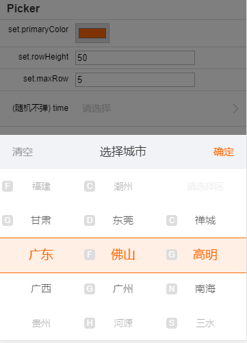
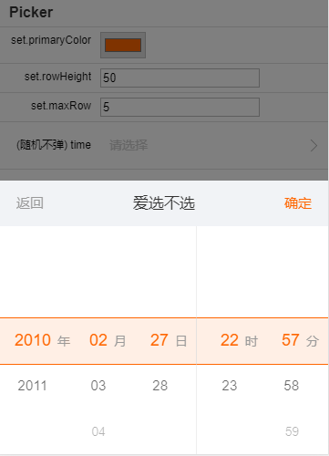

# BuildHTML用于前端HTML模板解析

这段代码是以前在多个项目中使用的（包括PC端、移动端、还有Android、IOS Hybrid App），代码简单轻巧，但功能一点都不简单。100行代码不到，Uglify压缩后1k大小（可选移除_eval后0.8k）。

演示地址：[https://xiangyuecn.github.io/BuildHTML/](https://xiangyuecn.github.io/BuildHTML/)


## 特性

- 语法简单，只有`{{}}`、`{}`两种。

- 内部使用eval实现（带缓存，并非每次都eval），因此可以在模板内书写小段js，单次小功能无需定义成函数。

- 模板内可直接访问当前对象的属性和函数。

- 模板内可直接访问全局属性和函数。

- 未特意多写一个`:控制符`时输出的属性或者函数返回值统统会进行HTML实体转义。

- 由于可书写js和访问全局变量，因此支持循环、嵌套、递归。

- 纯粹将模板解析成HTML的效率是非常高的。


## 缺陷

- 由于使用方式上的问题，生成出来的html往往被直接用`.html(html)`输出网页里面，进而整个流程可以作为性能低下的代表。


# 使用方法

1. 定义模板

> 如果你不能控制多行文本的定义，推荐简单使用`<script type="text/template" class="tp">`标签包裹文本数据，然后`$(".tp").html()`获取模板文本

``` javascript
//注：用"`"声明多行字符串不能在过气的浏览器中使用，因此需要自行控制

var mytp=`
<div>
	{name}第一次使用模板，请多多指教。{:html}
	
	{_tempVar="<div>临时变量</div>";''} {:_tempVar+1} {_tempVar+2}
	
	{{@@_tp=
		<div class="aa">
			<style>.aa{ color:red; }</style>
			{fn:BuildHTMLArray.index}内部模板循环
			{{:
				var s=xxNum;
				s+=654000;
				o.name+s
			}}
		</div>
	@@}}
	
	{fn::window.xxNum=321;BuildHTMLArray(o._tp,[o,o,o])}
</div>
`;
```

2. 解析模板
```javascript
var data={//假装有段数据
	name:"豆豆<i>"
	,html:"<span style='color:green'>面向大海春暖花开</span>"
};

var html=BuildHTML(mytp,data);//解析

console.log(html);
//$("body").html(html);//显示到他该去的地方
```


# 语法

HTML模板内通过嵌入特定格式的`js代码`来实现内容的自动生成。

所有嵌入的`js代码`可读写`o对象`(为啥用o，`o=object`，一个字母简短啊)，`o对象`为当前传入的数据对象（对象可以是null、object、数字、文本...）；多个嵌入代码块之间运行时如果需要传递临时变量数据，可以y用一个临时的属性名称存入o对象中。


## 一、行内js代码：{}

此语法求整个代码在一行，并且以非空白内容开头，多行请使用前置语法。

> 为了避免把模板内的`.css{width:10px}`这种css定义也识别为模板的语法，因此js代码必须以非空白内容开头，css定义的`{`后面需加一个空格变成：`.css{ width:10px }`

## 写法

- **{varName}** ：简单读取对象的属性，并返回纯文本，会进行HTML实体转义。此种类型的语法只是自动在代码前面加了`o.`，简化了对对象属性的获取。比如：`{name}`表示取`o.name`作为返回值。其实后面还可以接更多的js代码（同一行、不存在`}`截断字符），比如：`{num-100?'有':'无'}`表示执行表达式`o.num-100?'有':'无'`作为返回值。

- **{:varName}** ：同上一条，只是返回的结果不会进行HTML实体转义，用于返回html。

- **{fn:单行js代码;返回纯文本}** ：执行一段js代码，返回纯文本，会进行HTML实体转义。比如`{fn:window.Exec(o.name)}`代表调用全局函数`Exec`，参数为当前对象的`name属性`，函数的返回值会被HTML实体转义。

- **{fn::单行js代码;返回html}** ：这个和`{fn:}`语法一致，只是返回的结果不会进行HTML实体转义，用于返回html。


## 二、多行、前置js代码：{{}}

> 此语法会在所有`{}`声明的js之前执行，因此可用来动态生成`{{}}`、`{}`和预处理

### 写法：

- **{{@abc@...@abc@}}** ：两个相同的`@abc@`包裹的文本为一段有效的代码，`abc`可以为任意字母，也可以简化成`{{@@...@@}}`。以下格式中都支持这种声明写法。主要用在代码内如果出现`}}`，如果不这样写会被截断代码（因为实现起来简单）。

- **{{varName=多行文本}}** ：定义多行文本变量，无返回值；一般用于内部模板文本的定义。文本会赋值给o.varName，比如`{{@@_tp_=多行文本@@}}`，最终结果：`o._tp_="多行文本"`。

- **{{::多行js代码;返回html}}** ：执行多行js代码，并原样返回输出的内容，因为不会进行HTML实体转义，可用于返回html。比如：`{{::var i="<div>";i}}`结果为`<div>`。注意：倒数第二句代码结尾需要带`;`（因为实现起来简单）。

- **{{:多行js代码;返回纯文本}}** ：和`{{::}}`语法相同，只是返回结果会进行HTML实体转义，比如：`{{@@:var i="<div>";i@@}}`结果为`&#60;div&#62;`。


# 方法和属性

名称|说明
:-|:-
**BuildHTML(tp,obj)** | `tp`:html模板字符串。`obj`:数据对象，obj.BuildHTML_DisableSimple为特殊属性值，设为true可阻止{}的解析，只会对{{}}进行解析，方便在出现大量{}内容时使用。
**BuildHTML.CacheE** | eval缓存，可设置一个空对象清除缓存，方便测试用。
**BuildHTMLArray(tp,list,check)** | `tp`:html模板字符串。`list`:对象数组。`check:fn(item,index)`：检查函数，`item`为当前遍历到的对象，`index`为item在list中的索引，返回false可以停止遍历。
**BuildHTMLArray.index** | 当前遍历的索引。
**BuildHTMLArray.list** | 当前遍历的数组引用。


# 进一步缩小精简js

BuildHTML用Uglify压缩后1k大小，如果你对列表使用无多少要求，可以把对列表解析优化部分移除，然后变成了0.8k。

移除方法：删除代码后段_eval部分，把代码中两处引用_eval(x)()的代码改成eval(x)即可，结果：损失了eval解析缓存，仅仅影响列表性质的模板解析速度，因为没有缓存了，每次都要调用重量级的eval或Function。


# 应用

因为有BuildHTML，对于复杂多变的界面的编写变得简单。我写的一个picker多功能选择器，最底层因为使用了BuildHTML，不管上层是日期、城市、还是通用分类的选择需求，都能快速的构建出相应的界面HTML。

欢迎扫码体验：

[](https://jiebian.life/start/test/app?picker=1) https://jiebian.life/start/test/app?picker=1


截段核心的界面源码(不开源)看看：


应用截图:

  


# :star:捐赠
如果这个库有帮助到您，请 Star 一下。

您也可以使用支付宝或微信打赏作者：

  

